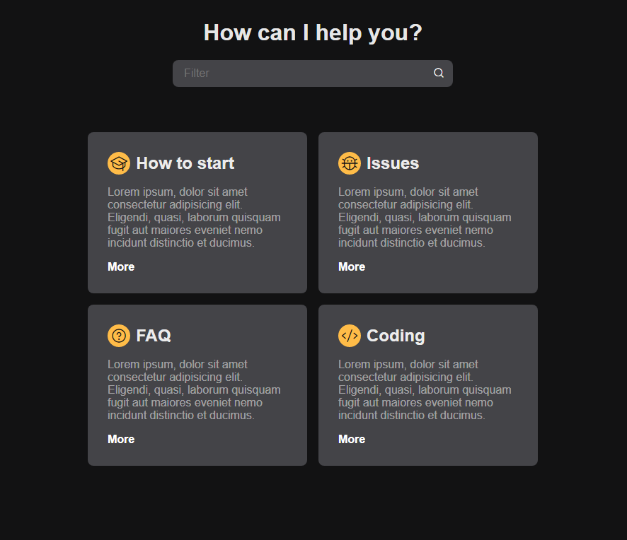

<h1 align="center"> Filter Cards </h1>

Este é um projeto básico de manipulação de DOM, onde o objetivo é encontrar os cartões que possuem as informações escritas pelo usuário na barra de pesquisa.
O modelo pode ser facilmente adaptado para diversos projetos.  

  <a href="#-tecnologias">Tecnologias</a>&nbsp;&nbsp;&nbsp;|&nbsp;&nbsp;&nbsp;
  <a href="#-projeto">Projeto</a>&nbsp;&nbsp;&nbsp;|&nbsp;&nbsp;&nbsp;
  <a href="#-layout">Layout</a>&nbsp;&nbsp;&nbsp;|&nbsp;&nbsp;&nbsp;
  <a href="#memo-licença">Licença</a>

  

 

  

## 🚀 Tecnologias

Esse projeto foi desenvolvido com as seguintes tecnologias:

- HTML e CSS
- JavaScript
- Git e Github
- Figma

## 💻 Projeto

O Filter Cards é um aplicativo básico de busca de cartões.

- [Visite o projeto online](https://evilisglenio.github.io/Filter-Cards/)

## :memo: Licença

Esse projeto está sob a licença MIT.

---

Feito com ♥ by EvilisGlenio :wave: [Meu contato:](glenio.developer@gmail.com)
